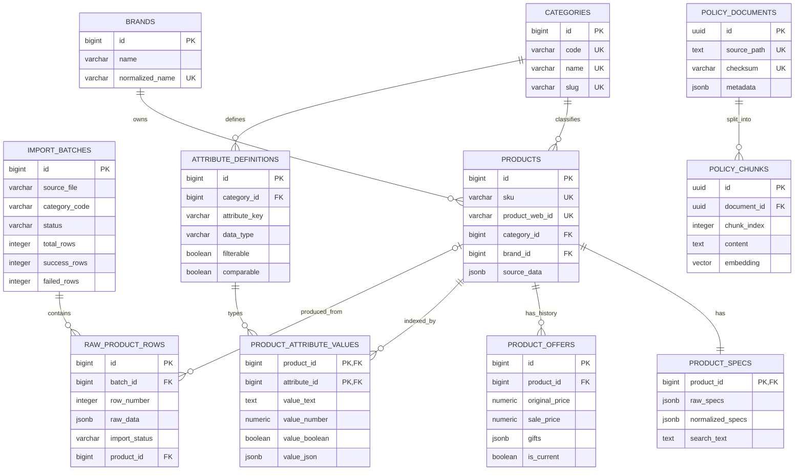

# Database NeedWise — Hybrid Relational + JSONB + Typed Facet Index

> Snapshot được kiểm tra trực tiếp trên Neon ngày **18/07/2026**. Alembic revision hiện tại: **`20260718_0005` (head)**. Tài liệu không chứa mật khẩu, hostname riêng hoặc connection string thật.

## 1. Tổng quan

NeedWise sử dụng PostgreSQL cho catalog 8.746 sản phẩm thuộc 14 ngành hàng và policy RAG. Catalog chính không còn lấy 14 bảng sản phẩm độc lập làm read model. Nguồn dữ liệu chuẩn của API là kiến trúc hybrid:

```text
14 CSV
  → import_batches
  → raw_product_rows
  → categories / brands / products
  → product_specs (raw_specs + normalized_specs)
  → product_offers
  → attribute_definitions
  → product_attribute_values

Policy files
  → policy_rag.policy_documents
  → policy_rag.policy_chunks (vector)
```

Thông tin môi trường đã xác minh:

| Thuộc tính | Giá trị |
|---|---|
| Ứng dụng | NeedWise / AI Product Comparison Advisor |
| PostgreSQL cloud | Neon PostgreSQL 17.10 |
| Database cloud thực tế | `neondb` |
| Encoding | `UTF8` |
| Extension | `pgcrypto 1.3`, `vector 0.8.0` |
| Embedding dimension | 384, đọc từ `POLICY_EMBEDDING_DIMENSION` khi migration/index |
| Alembic head | `20260718_0005` |

Ở môi trường local, database mặc định trong `.env.example` là `needwise`. Tên database vật lý có thể khác giữa local và Neon; code chỉ sử dụng `DATABASE_URL`, không hard-code database name hay credential.

## 2. Nguyên tắc thiết kế

- Cột chung và khóa ngoại nằm trong bảng quan hệ.
- Toàn bộ thông số gốc nằm trong `product_specs.raw_specs JSONB` để không mất dữ liệu.
- Thông số parse thành công nằm trong `product_specs.normalized_specs JSONB` theo nhóm nghiệp vụ.
- Chỉ thuộc tính cần lọc hoặc so sánh thường xuyên được materialize vào `product_attribute_values`.
- Giá và quà khuyến mãi có lịch sử riêng trong `product_offers`.
- Mỗi dòng CSV có lineage trong `import_batches` và `raw_product_rows`.
- SKU là định danh upsert ưu tiên; `product_web_id` chỉ là fallback.
- Không dùng EAV thuần túy và không tạo một bảng sản phẩm có hàng trăm cột.
- Các bảng raw/legacy vẫn được giữ để đối chiếu và rollback, nhưng không phải nguồn truy vấn chính của API.

## 3. Sơ đồ quan hệ



## 4. Kiểm kê dữ liệu production

### 4.1. Tổng quan các lớp

| Bảng/lớp | Số dòng | Vai trò |
|---|---:|---|
| `categories` | 14 | Danh mục chuẩn |
| `brands` | 143 | Brand đã chuẩn hóa |
| `products` | 8.746 | Product master |
| `product_specs` | 8.746 | Raw và normalized specifications |
| `product_specs` có normalized data | 7.698 | Có ít nhất một thông số parse an toàn |
| `product_offers` | 17.462 | Toàn bộ lịch sử offer |
| `product_offers` current | 8.746 | Đúng một current offer cho mỗi product |
| `attribute_definitions` | 152 | Metadata typed facets |
| `product_attribute_values` | 69.496 | Typed facet values |
| `import_batches` | 46 | Lịch sử chạy importer |
| `raw_product_rows` | 26.386 | Dòng nguồn của các lần import |
| `policy_rag.policy_documents` | 6 | Policy documents chuẩn UUID |
| `policy_rag.policy_chunks` | 66 | Policy chunks và embeddings |

`import_batches`, `raw_product_rows` và tổng `product_offers` tăng theo lịch sử chạy. Con số 8.746 current offer và 8.746 product mới là invariant của snapshot catalog hiện tại.

### 4.2. Row count theo category

| Category code | Tên | Products | Latest batch success | Failed |
|---|---|---:|---:|---:|
| `refrigerators` | Tủ lạnh | 1.692 | 1.692 | 0 |
| `air_conditioners` | Máy lạnh | 1.039 | 1.039 | 0 |
| `washing_machines` | Máy giặt | 1.337 | 1.337 | 0 |
| `clothes_dryers` | Máy sấy quần áo | 107 | 107 | 0 |
| `dishwashers` | Máy rửa chén | 134 | 134 | 0 |
| `coolers_freezers` | Tủ mát, tủ đông | 222 | 222 | 0 |
| `water_heaters` | Máy nước nóng | 319 | 319 | 0 |
| `karaoke_microphones` | Micro karaoke | 37 | 37 | 0 |
| `phone_recording_microphones` | Micro thu âm điện thoại | 33 | 33 | 0 |
| `smartwatches` | Đồng hồ thông minh | 1.336 | 1.336 | 0 |
| `desktop_computers` | Máy tính để bàn | 405 | 405 | 0 |
| `computer_monitors` | Màn hình máy tính | 469 | 469 | 0 |
| `printers` | Máy in | 147 | 147 | 0 |
| `tablets` | Máy tính bảng | 1.469 | 1.469 | 0 |
| **Tổng** | **14 ngành hàng** | **8.746** | **8.746** | **0** |

### 4.3. Kiểm tra integrity

| Kiểm tra | Kết quả |
|---|---:|
| SKU trùng | 0 |
| Product inactive sau import | 0 |
| Product có hơn một current offer | 0 |
| Product không có brand do nguồn trống | 18 |
| Product chưa có normalized specs | 1.048 |
| Attribute warnings ở lượt import cuối | 3.553 |

Warning là số thuộc tính không parse được, không phải số dòng lỗi. Giá trị gốc vẫn nằm trong `raw_specs`; importer không ghi typed value nếu không chắc chắn.

## 5. Schema catalog chính

### 5.1. `import_batches`

Theo dõi mỗi lần import CSV.

| Cột | Kiểu | Ràng buộc/ý nghĩa |
|---|---|---|
| `id` | `BIGSERIAL` | PK |
| `source_file` | `VARCHAR(500)` | NOT NULL |
| `category_code` | `VARCHAR(100)` | NOT NULL, indexed |
| `checksum` | `VARCHAR(128)` | SHA/checksum file, nullable |
| `status` | `VARCHAR(30)` | `pending`, `processing`, `completed`, `completed_with_errors`, `failed` |
| `total_rows` | `INTEGER` | Mặc định 0 |
| `success_rows` | `INTEGER` | Mặc định 0 |
| `failed_rows` | `INTEGER` | Mặc định 0 |
| `started_at` | `TIMESTAMPTZ` | Thời điểm bắt đầu |
| `completed_at` | `TIMESTAMPTZ` | Thời điểm hoàn tất |
| `created_at` | `TIMESTAMPTZ` | Mặc định `NOW()` |

Status được bảo vệ bằng `import_batches_status_check`.

### 5.2. `raw_product_rows`

Lưu nguyên bản từng dòng CSV dưới dạng JSONB và trạng thái xử lý.

| Cột | Kiểu | Ràng buộc/ý nghĩa |
|---|---|---|
| `id` | `BIGSERIAL` | PK |
| `batch_id` | `BIGINT` | FK → `import_batches.id`, `ON DELETE CASCADE` |
| `row_number` | `INTEGER` | Số dòng trong file |
| `raw_data` | `JSONB` | Dữ liệu nguồn nguyên bản |
| `import_status` | `VARCHAR(30)` | `pending`, `processing`, `imported`, `skipped`, `failed` |
| `product_id` | `BIGINT` | FK nullable → `products.id` |
| `error_message` | `TEXT` | Lỗi chi tiết nếu có |
| `created_at` | `TIMESTAMPTZ` | Mặc định `NOW()` |

Ràng buộc UNIQUE `(batch_id, row_number)` bảo đảm một dòng chỉ xuất hiện một lần trong cùng batch.

### 5.3. `categories`

| Cột | Kiểu | Ràng buộc |
|---|---|---|
| `id` | `BIGSERIAL` | PK |
| `code` | `VARCHAR(100)` | NOT NULL, UNIQUE; khóa ổn định dùng trong API/importer |
| `name` | `VARCHAR` | NOT NULL, UNIQUE |
| `slug` | `VARCHAR` | NOT NULL, UNIQUE, indexed |
| `description` | `TEXT` | Nullable |
| `is_active` | `BOOLEAN` | Mặc định `TRUE` |
| `created_at` | `TIMESTAMPTZ` | Mặc định `NOW()` |
| `updated_at` | `TIMESTAMPTZ` | Mặc định `NOW()` |

Seed đủ 14 code liệt kê ở mục 4.2 và có thể chạy lại mà không tạo duplicate.

### 5.4. `brands`

| Cột | Kiểu | Ràng buộc/ý nghĩa |
|---|---|---|
| `id` | `BIGSERIAL` | PK nội bộ |
| `name` | `VARCHAR(150)` | Tên hiển thị canonical |
| `normalized_name` | `VARCHAR(150)` | NOT NULL, UNIQUE |
| `source_brand_id` | `VARCHAR(100)` | ID nguồn, không dùng làm PK |
| `created_at` | `TIMESTAMPTZ` | Mặc định `NOW()` |
| `updated_at` | `TIMESTAMPTZ` | Mặc định `NOW()` |

Ví dụ `Samsung`, `SAMSUNG`, `Samsung Việt Nam` được đưa về `normalized_name = 'samsung'`.

### 5.5. `products`

`products` là product master và nguồn chính của API.

| Cột mới/chính | Kiểu | Ràng buộc/ý nghĩa |
|---|---|---|
| `id` | `BIGSERIAL` | PK |
| `sku` | `VARCHAR` | NOT NULL, UNIQUE |
| `product_web_id` | `VARCHAR` | UNIQUE khi khác NULL |
| `model_code` | `VARCHAR` | Nullable, indexed |
| `category_id` | `BIGINT` | FK → `categories.id`, indexed |
| `brand_id` | `BIGINT` | FK nullable → `brands.id`, indexed |
| `display_name` | `VARCHAR` | NOT NULL |
| `status` | `VARCHAR(30)` | `active`, `inactive`, `draft`, `archived` |
| `source_data` | `JSONB` | Metadata nguồn/common data chưa ánh xạ |
| `created_at` | `TIMESTAMPTZ` | Mặc định `NOW()` |
| `updated_at` | `TIMESTAMPTZ` | Mặc định `NOW()` |

Các cột compatibility cũ `slug`, `name`, `brand`, `short_description`, `image_url`, `featured`, `rating`, `review_count`, `specifications` vẫn được giữ để Web/API cũ hoạt động trong giai đoạn chuyển đổi. Code mới ưu tiên `brand_id`, `display_name`, `product_specs` và `product_offers`.

Index chính:

- UNIQUE `sku`.
- Partial UNIQUE `product_web_id WHERE product_web_id IS NOT NULL`.
- B-tree `category_id`, `brand_id`, `model_code`, `status`, `(category_id, brand_id)`.
- GIN compatibility trên `specifications`.

Nguồn có 1.448 nhóm `productidweb` trùng giữa các SKU. Chỉ web ID duy nhất toàn catalog được đặt vào cột UNIQUE; giá trị trùng vẫn được bảo toàn trong `source_data.raw_product_web_id`.

Dữ liệu có 1.199 nhóm trùng hợp lệ theo `(category_id, brand_id, model_code)`, vì vậy không tạo UNIQUE constraint cho bộ ba này.

### 5.6. `product_specs`

| Cột chính | Kiểu | Ràng buộc/ý nghĩa |
|---|---|---|
| `product_id` | `BIGINT` | PK và FK → `products.id`, `ON DELETE CASCADE` |
| `raw_specs` | `JSONB` | Toàn bộ thông số ngoài các cột common |
| `normalized_specs` | `JSONB` | Thông số đã parse theo nhóm |
| `search_text` | `TEXT` | Nội dung tổng hợp cho full-text/embedding |
| `created_at` | `TIMESTAMPTZ` | Mặc định `NOW()` |
| `updated_at` | `TIMESTAMPTZ` | Mặc định `NOW()` |

Các cột legacy dành cho máy lạnh (`capacity_btu`, `horsepower`, `recommended_area_min/max`, `inverter`, `noise_db`, `energy_rating`, `warranty_months`) và `id` cũ vẫn được giữ để tương thích; `product_id` mới là primary key thật.

Index:

- `idx_product_specs_raw_gin`: GIN trên `raw_specs`.
- `idx_product_specs_normalized_gin`: GIN `jsonb_path_ops` trên `normalized_specs`.
- `idx_product_specs_search_text`: full-text GIN với cấu hình `simple`.

Ví dụ normalized refrigerator:

```json
{
  "capacity": {
    "total_liter": 406,
    "freezer_liter": 93,
    "refrigerator_liter": 313
  },
  "dimensions_mm": {
    "height": 1715,
    "width": 700,
    "depth": 672
  },
  "recommended_users": {
    "min": 3,
    "max": 4
  },
  "energy": {
    "consumption_kwh_per_day": 1.05,
    "inverter": true
  }
}
```

### 5.7. `product_offers`

| Cột | Kiểu | Ràng buộc/ý nghĩa |
|---|---|---|
| `id` | `BIGSERIAL` | PK |
| `product_id` | `BIGINT` | FK → `products.id`, `ON DELETE CASCADE` |
| `original_price` | `NUMERIC(15,2)` | Nullable, phải ≥ 0 |
| `sale_price` | `NUMERIC(15,2)` | Nullable, phải ≥ 0 và ≤ original price |
| `currency` | `CHAR(3)` | Mặc định `VND` |
| `gifts` | `JSONB` | Array JSON, mặc định `[]` |
| `valid_from` | `TIMESTAMPTZ` | Nullable |
| `valid_to` | `TIMESTAMPTZ` | Phải lớn hơn `valid_from` nếu có |
| `is_current` | `BOOLEAN` | Mặc định `TRUE` |
| `created_at` | `TIMESTAMPTZ` | Mặc định `NOW()` |
| `updated_at` | `TIMESTAMPTZ` | Mặc định `NOW()` |

Partial unique index `idx_one_current_offer_per_product` bảo đảm mỗi product tối đa một current offer. Khi giá thay đổi, importer đóng offer cũ và tạo offer mới; khi dữ liệu không đổi, chạy lại không tạo offer mới.

`gifts` có cấu trúc:

```json
[
  {"type": "gift", "name": "Phiếu mua hàng 500.000 đồng"},
  {"type": "installment", "name": "Trả góp 0%"}
]
```

### 5.8. `attribute_definitions`

| Cột | Kiểu | Ý nghĩa |
|---|---|---|
| `id` | `BIGSERIAL` | PK |
| `category_id` | `BIGINT` | FK → `categories.id`, `ON DELETE CASCADE` |
| `attribute_key` | `VARCHAR(150)` | Key chuẩn dùng trong API |
| `source_column` | `VARCHAR(150)` | Cột CSV nguồn |
| `display_name` | `VARCHAR(255)` | Tên hiển thị |
| `data_type` | `VARCHAR(30)` | `text`, `number`, `boolean`, `array`, `range`, `object` |
| `unit` | `VARCHAR(50)` | Đơn vị chuẩn |
| `group_name` | `VARCHAR(100)` | Nhóm normalized JSON |
| `filterable` | `BOOLEAN` | Có được dùng trong filter API |
| `comparable` | `BOOLEAN` | Có hiển thị khi compare |
| `display_order` | `INTEGER` | Thứ tự hiển thị |
| `aliases` | `JSONB` | Array alias |
| `normalization_config` | `JSONB` | Cấu hình/parser path |
| `created_at`, `updated_at` | `TIMESTAMPTZ` | Audit timestamps |

UNIQUE `(category_id, attribute_key)` ngăn định nghĩa trùng trong cùng ngành hàng.

Các typed facet quan trọng đã seed:

| Category | Attribute keys tiêu biểu |
|---|---|
| Refrigerators | `total_capacity_liter`, `freezer_capacity_liter`, `recommended_users_min/max`, `door_count`, `inverter`, `height_mm`, `width_mm`, `depth_mm`, `weight_kg` |
| Air conditioners | `capacity_btu`, `recommended_area_min/max_m2`, `inverter`, `energy_rating`, `power_consumption_kw`, `noise_db`, `gas_type` |
| Washing machines | `washing_capacity_kg`, `recommended_users_min/max`, `max_spin_speed_rpm`, `inverter`, `dryer_supported`, dimensions |
| Clothes dryers | `drying_capacity_kg`, `dryer_technology`, `energy_consumption_kwh`, `sensor_features`, dimensions |
| Dishwashers | `place_settings`, `water_consumption_liter`, `noise_db`, `program_count`, dimensions |
| Coolers/freezers | `total_capacity_liter`, `door_count`, `compartment_count`, `freezer_temperature_celsius`, `inverter`, dimensions |
| Water heaters | `capacity_liter`, `power_watt`, `max_temperature_celsius`, `has_booster_pump`, `safety_features`, dimensions |
| Karaoke microphones | frequency range, band, distortion, product type, manufacture year |
| Phone recording microphones | transmission distance, battery/runtime, frequency range, connection, compatibility |
| Smartwatches | screen, battery/runtime, water resistance, GPS, SIM/calling, OS, case width, weight |
| Desktop computers | CPU, RAM, storage, GPU, OS, Wi-Fi, PSU |
| Computer monitors | screen, resolution, panel, response time, brightness, contrast, touch, speaker, VESA |
| Printers | speed, resolution, duty cycle, paper capacity, duplex, connection, printer/ink type, power |
| Tablets | screen, battery, RAM, storage, CPU/GPU, OS, SIM/calling, charging, weight |

### 5.9. `product_attribute_values`

Typed facet index chỉ chứa các thuộc tính cần filter/compare.

| Cột | Kiểu | Ý nghĩa |
|---|---|---|
| `product_id` | `BIGINT` | PK/FK → `products.id`, cascade |
| `attribute_id` | `BIGINT` | PK/FK → `attribute_definitions.id`, cascade |
| `raw_value` | `TEXT` | Giá trị nguồn để đối chiếu |
| `value_text` | `TEXT` | Giá trị text đã chuẩn hóa |
| `value_number` | `NUMERIC` | Số chính xác; không dùng FLOAT |
| `value_boolean` | `BOOLEAN` | Boolean chuẩn |
| `value_json` | `JSONB` | Array/range/object |
| `unit` | `VARCHAR(50)` | Đơn vị chuẩn |
| `created_at`, `updated_at` | `TIMESTAMPTZ` | Audit timestamps |

Primary key `(product_id, attribute_id)` bảo đảm một product chỉ có một value cho mỗi definition. CHECK constraint yêu cầu có ít nhất một typed value khi `raw_value` không rỗng.

Index:

- `idx_attribute_numeric_filter(attribute_id, value_number)` khi number khác NULL.
- `idx_attribute_text_filter(attribute_id, value_text)` khi text khác NULL.
- `idx_attribute_boolean_filter(attribute_id, value_boolean)` khi boolean khác NULL.
- `idx_attribute_json_gin` trên `value_json` khi JSON khác NULL.

## 6. Policy RAG schema

### 6.1. `policy_rag.policy_documents`

| Cột | Kiểu | Ràng buộc |
|---|---|---|
| `id` | `UUID` | PK, `gen_random_uuid()` |
| `source_path` | `TEXT` | NOT NULL, UNIQUE |
| `title` | `TEXT` | Nullable |
| `checksum` | `VARCHAR(128)` | NOT NULL, UNIQUE |
| `document_type` | `VARCHAR(100)` | Nullable |
| `metadata` | `JSONB` | Mặc định `{}` |
| `created_at`, `updated_at` | `TIMESTAMPTZ` | Audit timestamps |

### 6.2. `policy_rag.policy_chunks`

| Cột | Kiểu | Ràng buộc |
|---|---|---|
| `id` | `UUID` | PK, `gen_random_uuid()` |
| `document_id` | `UUID` | FK → `policy_documents.id`, cascade |
| `chunk_index` | `INTEGER` | Thứ tự trong document |
| `content` | `TEXT` | NOT NULL |
| `token_count` | `INTEGER` | Nullable |
| `metadata` | `JSONB` | Mặc định `{}` |
| `embedding` | `VECTOR(384)` | Nullable để migration/index graceful |
| `embedding_model` | `VARCHAR(150)` | Model tạo vector |
| `created_at`, `updated_at` | `TIMESTAMPTZ` | Audit timestamps |

Ràng buộc UNIQUE `(document_id, chunk_index)`. HNSW index `idx_policy_chunks_embedding_hnsw` dùng `vector_cosine_ops` đã được tạo thành công.

Các bảng RAG cũ `policy_rag.documents`, `policy_rag.chunks`, `policy_rag.index_metadata` vẫn được giữ để rollback. Dữ liệu 6 documents/66 chunks đã được copy sang schema UUID mới; code RAG mới đọc/ghi `policy_documents` và `policy_chunks`.

## 7. Mapping CSV và luồng import

### 7.1. Mapping trường chung

| CSV | Đích |
|---|---|
| `sku` | `products.sku` |
| `productidweb` | `products.product_web_id` hoặc `source_data.raw_product_web_id` nếu trùng |
| `model_code` | `products.model_code` |
| `category_code` | Registry → `categories.code` |
| `brand` | `brands` + `products.brand_id` |
| `brand_id` nguồn | `brands.source_brand_id` |
| `gia_goc` | `product_offers.original_price` |
| `gia_khuyen_mai` | `product_offers.sale_price` |
| `khuyen_mai_qua` | `product_offers.gifts[]` |
| Các cột còn lại | `product_specs.raw_specs` |
| Giá trị parse thành công | `product_specs.normalized_specs` |
| Thuộc tính filter/compare | `product_attribute_values` |

### 7.2. Quy tắc upsert

1. Tìm product theo SKU.
2. Nếu SKU rỗng, thử `product_web_id` duy nhất.
3. Nếu cả hai rỗng, đánh dấu raw row `failed`; không tạo product không có định danh đáng tin cậy.
4. Product đã tồn tại được cập nhật relational fields và specs.
5. Giá/quà thay đổi sẽ đóng current offer cũ và tạo offer mới.
6. Typed values được upsert theo `(product_id, attribute_id)`.
7. Lỗi parse một field chỉ sinh warning; raw value vẫn được giữ.
8. Lỗi một dòng không dừng batch trừ khi dùng `--fail-fast`.

Importer dùng common pipeline + category registry + reusable parsers, không có 14 pipeline độc lập.

### 7.3. CLI

Từ `apps/api`:

```powershell
python -m app.importers.csv_importer `
  --directory ../../data/realdata/raw/clean `
  --batch-size 500 `
  --update-existing
```

Import một file:

```powershell
python -m app.importers.csv_importer `
  --category refrigerators `
  --file ../../data/realdata/raw/clean/tu_lanh.csv
```

Các option: `--dry-run`, `--limit`, `--batch-size`, `--update-existing`, `--skip-existing`, `--fail-fast`.

## 8. API sử dụng database

| Endpoint | Vai trò |
|---|---|
| `GET /api/v1/health/db` | Kiểm tra kết nối và extensions |
| `GET /api/v1/categories` | Danh sách 14 category |
| `GET /api/v1/products` | List/search compatibility |
| `GET /api/v1/products/{id-or-slug}` | Product detail |
| `GET /api/v1/products/compare?ids=...` | So sánh 2–4 sản phẩm |
| `POST /api/v1/products/search` | Dynamic typed facet search |

Dynamic search chỉ chấp nhận `attribute_key` tồn tại và `filterable = TRUE` trong `attribute_definitions`. Client không thể truyền table name hoặc SQL fragment.

Ví dụ:

```json
{
  "category_code": "refrigerators",
  "price_max": 15000000,
  "filters": {
    "total_capacity_liter": {"gte": 300, "lte": 500},
    "inverter": {"eq": true}
  },
  "sort": [{"field": "sale_price", "direction": "asc"}],
  "limit": 20
}
```

Snapshot Neon hiện trả `total = 56` cho ví dụ trên. Key không tồn tại trả HTTP 422.

## 9. Index và constraint quan trọng

- UNIQUE `products.sku`.
- Partial UNIQUE current offer trên `product_offers(product_id)`.
- GIN trên raw/normalized specs.
- Full-text GIN trên `product_specs.search_text`.
- Typed partial indexes cho number/text/boolean và GIN cho JSON facet.
- HNSW cosine trên `policy_rag.policy_chunks.embedding`.
- Cascade batch → raw rows.
- Cascade product → specs/offers/facets.
- Cascade category → attribute definitions.
- Cascade policy document → chunks.
- CHECK status của batch/product/raw row.
- CHECK type của attribute definition.
- CHECK giá không âm, sale không lớn hơn original và khoảng hiệu lực hợp lệ.
- CHECK `gifts`/`aliases` là JSON array.

## 10. Migration

| Revision | Nội dung |
|---|---|
| `20260717_0001` | Schema API ban đầu |
| `20260718_0002` | Catalog compatibility bridge |
| `20260718_0003` | pgvector và policy RAG legacy |
| `20260718_0004` | JSONB catalog đa ngành compatibility |
| `20260718_0005` | Hybrid catalog, lineage, brands, offers, typed facets, UUID policy RAG |

`20260718_0005` không drop bảng/dữ liệu legacy. Downgrade có thể mất dữ liệu chỉ tồn tại trong các bảng mới và không tự thu hẹp BIGINT về INTEGER; phải backup trước downgrade.

Kiểm tra và chạy migration:

```powershell
cd apps/api
alembic current
alembic upgrade head
```

Kết quả đã xác minh:

```text
20260718_0005 (head)
```

Chạy `upgrade head` lần hai là no-op hợp lệ.

## 11. Truy vấn vận hành

### 11.1. Extension và revision

```sql
SELECT extname, extversion
FROM pg_extension
WHERE extname IN ('vector', 'pgcrypto')
ORDER BY extname;

SELECT version_num FROM alembic_version;
```

### 11.2. Count theo category

```sql
SELECT c.code, c.name, COUNT(p.id) AS product_count
FROM categories c
LEFT JOIN products p ON p.category_id = c.id
GROUP BY c.id, c.code, c.name
ORDER BY c.code;
```

### 11.3. Latest import batch

```sql
WITH ranked AS (
    SELECT b.*,
           ROW_NUMBER() OVER (PARTITION BY category_code ORDER BY id DESC) AS rn
    FROM import_batches b
)
SELECT category_code, source_file, total_rows, success_rows, failed_rows, status
FROM ranked
WHERE rn = 1
ORDER BY category_code;
```

### 11.4. Integrity

```sql
SELECT COUNT(*) AS duplicate_sku_groups
FROM (
    SELECT sku FROM products GROUP BY sku HAVING COUNT(*) > 1
) duplicated;

SELECT COUNT(*) AS products_with_multiple_current_offers
FROM (
    SELECT product_id
    FROM product_offers
    WHERE is_current
    GROUP BY product_id
    HAVING COUNT(*) > 1
) duplicated;

SELECT
    COUNT(*) AS total_products,
    COUNT(*) FILTER (WHERE brand_id IS NULL) AS products_without_brand
FROM products;
```

### 11.5. JSONB specs

```sql
SELECT p.sku,
       ps.normalized_specs #>> '{capacity,total_liter}' AS capacity_liter,
       ps.normalized_specs #>> '{energy,inverter}' AS inverter
FROM products p
JOIN categories c ON c.id = p.category_id
JOIN product_specs ps ON ps.product_id = p.id
WHERE c.code = 'refrigerators'
  AND ps.normalized_specs @> '{"energy":{"inverter":true}}'::jsonb
LIMIT 20;
```

### 11.6. Typed numeric facet

```sql
SELECT p.sku, pav.value_number, pav.unit
FROM product_attribute_values pav
JOIN attribute_definitions ad ON ad.id = pav.attribute_id
JOIN products p ON p.id = pav.product_id
JOIN categories c ON c.id = ad.category_id
WHERE c.code = 'tablets'
  AND ad.attribute_key = 'ram_gb'
  AND pav.value_number >= 8
ORDER BY pav.value_number DESC;
```

### 11.7. Current offer

```sql
SELECT p.sku, o.original_price, o.sale_price, o.currency, o.gifts
FROM products p
JOIN product_offers o ON o.product_id = p.id AND o.is_current
ORDER BY o.sale_price NULLS LAST
LIMIT 20;
```

### 11.8. Policy RAG

```sql
SELECT
    (SELECT COUNT(*) FROM policy_rag.policy_documents) AS documents,
    (SELECT COUNT(*) FROM policy_rag.policy_chunks) AS chunks;

SELECT indexname, indexdef
FROM pg_indexes
WHERE schemaname = 'policy_rag'
  AND indexname = 'idx_policy_chunks_embedding_hnsw';
```

## 12. Bảng compatibility/legacy

Các bảng sau được giữ có chủ ý, không phải source of truth mới:

- 14 raw category tables: `refrigerators`, `air_conditioners`, `washing_machines`, `clothes_dryers`, `dishwashers`, `coolers_freezers`, `water_heaters`, `karaoke_microphones`, `phone_recording_microphones`, `smartwatches`, `desktop_computers`, `computer_monitors`, `printers`, `tablets`.
- `catalog_products` read model cũ.
- `prices`, `promotions`, `inventory` compatibility tables.
- `policy_rag.documents`, `policy_rag.chunks`, `policy_rag.index_metadata` RAG schema cũ.

Không chạy `src.seed.sync_catalog_products` sau hybrid import trong startup production; legacy sync không tạo normalized specs/typed facets và có thể ghi đè compatibility fields. Chỉ xóa legacy tables bằng cleanup migration riêng sau khi backup và hoàn tất một chu kỳ production verification.

## 13. Cấu hình và an toàn

- Không commit `.env` thật.
- API đọc `DATABASE_URL`; thao tác cloud có thể dùng `DATABASE_URL_CLOUD` qua script vận hành.
- Cấu hình hỗ trợ chạy từ repository root hoặc `apps/api`.
- Không log password hoặc toàn bộ DSN.
- Không dùng FLOAT cho giá.
- Không nối trực tiếp input người dùng vào SQL.
- Không `DROP`/`TRUNCATE` bảng legacy ngoài thao tác được phê duyệt và đã backup.
- Seed metadata là idempotent; lần chạy kiểm tra gần nhất tạo `0 categories / 0 attributes / 0 brands`.
- Importer mặc định không fail-fast và commit theo batch 200–500 dòng.

## 14. Kiểm thử đã thực hiện

- Backend unit/query/import/API: 32 passed khi không bật integration DB.
- Backend + Neon hybrid schema integration: 33 passed, 1 RAG integration test skipped.
- Integration test kiểm tra extensions, bảng, constraints, GIN/partial indexes và HNSW index.
- Ruff: pass.
- Mypy: pass trên 56 source files.
- Web Vitest: 4 passed.
- Next.js production build: thành công.
- `alembic upgrade head` và chạy lại migration: thành công.
- API thật: DB health 200, 14 categories, dynamic search 200, unknown facet 422, compare 200.

## 15. File liên quan

- Migration hybrid: [`apps/api/alembic/versions/20260718_0005_hybrid_catalog.py`](../apps/api/alembic/versions/20260718_0005_hybrid_catalog.py)
- SQLAlchemy models: [`apps/api/src/models/hybrid_catalog.py`](../apps/api/src/models/hybrid_catalog.py)
- Product model: [`apps/api/src/models/product.py`](../apps/api/src/models/product.py)
- Importer: [`apps/api/src/importers/csv_importer.py`](../apps/api/src/importers/csv_importer.py)
- Category registry: [`apps/api/src/importers/category_registry.py`](../apps/api/src/importers/category_registry.py)
- Parsers: [`apps/api/src/importers/normalizers/common.py`](../apps/api/src/importers/normalizers/common.py)
- Seed: [`apps/api/src/db/seed.py`](../apps/api/src/db/seed.py)
- Dynamic query repository: [`apps/api/src/repositories/product_repository.py`](../apps/api/src/repositories/product_repository.py)
- API routes: [`apps/api/src/api/v1/products.py`](../apps/api/src/api/v1/products.py)
- PostgreSQL integration test: [`apps/api/tests/test_hybrid_postgres_integration.py`](../apps/api/tests/test_hybrid_postgres_integration.py)
- Báo cáo migration: [`docs/hybrid-database-migration.md`](hybrid-database-migration.md)
- Hướng dẫn dự án: [`README.md`](../README.md)
