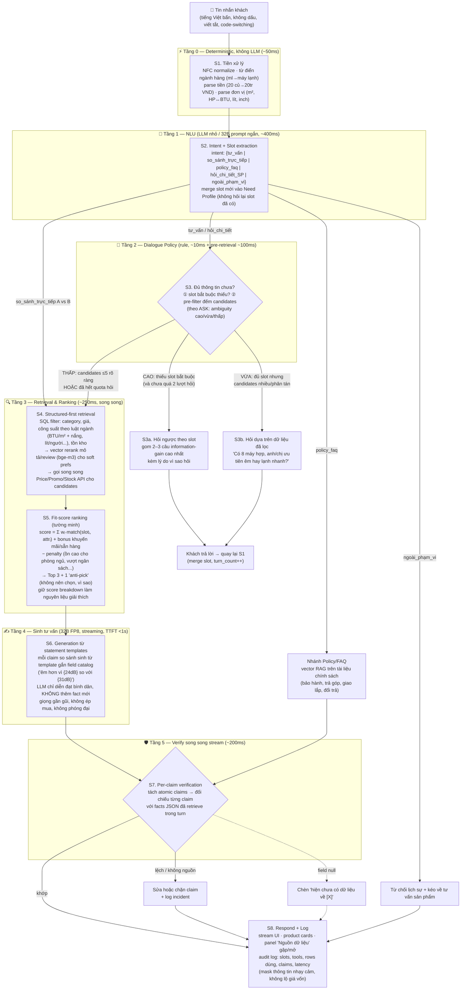

# Thiết kế luồng Workflow AI — Trợ lý tư vấn & so sánh sản phẩm ĐMX

> Bản v1 · 17/07/2026 · Dựa trên brief `Điện Máy Xanh.docx.pdf` + research tại `dmx-phan-tich-ke-hoach-2026-07-17.md`
> Hạ tầng chốt: 1× H100 80GB · Qwen2.5/3-32B FP8 (chính) + model nhỏ 4-8B (slot/draft) · vLLM (prefix caching + chunked prefill)

---

## 1. Tổng quan luồng xử lý một lượt chat



---

## 2. Trạng thái hội thoại (Conversation State)

Mỗi session giữ một **Need Profile** — đây là "bộ nhớ nhu cầu", quyết định mọi nhánh rẽ:

```json
{
  "category": "máy_lạnh",
  "slots": {
    "ngân_sách_max": 20000000,        // từ "dưới 20 củ"
    "diện_tích_m2": 18,
    "loại_phòng": null,                // ← thiếu, slot bắt buộc? không — nhưng information gain cao
    "nắng_trực_tiếp": null,
    "ưu_tiên": ["tiết_kiệm_điện", "êm"],
    "trả_góp": null
  },
  "asked_slots": ["loại_phòng", "nắng_trực_tiếp"],  // đã hỏi → không bao giờ hỏi lại
  "clarify_rounds": 1,                               // hard limit = 2
  "assumptions": []                                  // giả định mặc định khi hết quota hỏi
}
```

**Slot schema theo ngành hàng** (slot `*` = bắt buộc trước khi đề xuất; còn lại xếp theo information gain):

| Ngành hàng | Bắt buộc | Ưu tiên hỏi thêm (theo mức ảnh hưởng ranking) |
|---|---|---|
| Máy lạnh | ngân_sách, diện_tích | loại_phòng (→độ ồn), nắng (→+0.5HP), tiết_kiệm_điện/inverter, trả_góp |
| Tủ lạnh | ngân_sách, số_người | kiểu ngăn đá, kích thước chỗ đặt, inverter |
| Điện thoại | ngân_sách, mục_đích | camera/pin/game chi tiết, kích cỡ, brand ưa thích |
| Laptop | ngân_sách, công_việc | mang vác nhiều?, màn hình, RAM/GPU cho phần mềm cụ thể |
| Tai nghe | ngân_sách, mục_đích | over/in-ear, chống ồn, pin |

**Nguồn gốc slot schema (REVISED v2 — 17/07): AI tự sinh logic tư vấn, không phải dev viết config**

> H2 brief ghi "Bắt buộc: Có — **AI cần hiểu** logic tư vấn theo ngành hàng". Config tay của dev không thỏa chữ "hiểu" và chết khi thêm ngành hàng mới. Thiết kế lại thành 3 cơ chế:

**(1) Category Profile Compiler — pipeline AI offline chạy lúc ingest data** (dựa trên nghiên cứu Slot Schema Induction + attribute taxonomy bootstrapping):
```
Input:  catalog fields + phân bố giá trị · mô tả SP · bài hướng dẫn chọn mua (guide corpus) · scenarios (nếu có)
Bước:   LLM đọc catalog từng category → suy ra slot ứng viên (nhu cầu ↔ attribute nào)
        → sinh luật quy đổi (diện tích→BTU, trích từ guide, CÓ CITATION)
        → sinh câu hỏi mẫu + information gain tính từ phân bố catalog thật
        → auto-check "actionable" (slot phải map field/luật, không thì loại)
        → chuyên gia duyệt/sửa (human-in-the-loop — khớp brief mục F)
Output: category profile (JSON/YAML) — artifact do AI SINH, người DUYỆT, runtime ĐỌC
```
- Runtime vẫn đọc profile compiled → giữ nguyên latency + determinism + quota kiểm soát được
- Thêm ngành hàng mới (robot, tai nghe trong E1) = chạy compiler ~1 phút + duyệt → **demo live được** trước giám khảo

**(2) Dynamic aspect discovery ở runtime** (S3b đã có, nâng vai trò): khi candidates còn nhiều, chọn attribute phân tách tốt nhất **từ chính tập ứng viên đang có** (entropy trên live data) — hoạt động cả với category chưa có profile dày. Đây là lưới an toàn khi compiler sót slot.

**(3) Luật tư vấn qua RAG trên guide corpus, có citation**: "phòng nắng cần +0.5HP" không hardcode trong code — nó nằm trong tài liệu hướng dẫn chọn mua (nguồn: bài tư vấn DMX, tài liệu nhãn năng lượng), được retrieve + cite lúc dùng, gắn nhãn "quy tắc tư vấn" trong source log. AI "hiểu" = truy xuất và áp dụng có nguồn, nhất quán với guardrail.

**Bootstrap & fallback thực dụng cho 48h**: YAML v0 viết tay (từ brief H2 + facets DMX) vẫn làm ở Phase 0 làm nền chạy ngay + làm fallback; compiler v0 build ở Phase 3 chạy lại trên 4 ngành để so với bản tay (chính là validation), demo "thêm ngành hàng live" ở Phase 4 nếu xanh. 4 nguồn cũ (brief H2, data BTC, facets DMX, chuyên gia E3) **trở thành input của compiler** thay vì nguồn để dev viết tay.

**Quy tắc chuyển trạng thái quan trọng:**
- Khách đổi ngành hàng giữa chừng → reset slot ngành cũ, **giữ ngân sách + hỏi xác nhận nhẹ** ("Vẫn tầm 20 triệu như lúc nãy ạ?")
- Hết quota 2 lượt hỏi mà vẫn thiếu slot → đề xuất với **giả định mặc định nêu rõ** ("Em tạm tính cho phòng ngủ không nắng trực tiếp — nếu khác anh/chị bảo em nhé")
- Khách trả lời không liên quan câu hỏi → không hỏi lại câu cũ, xử lý input mới như turn thường

---

> ⚙️ **Quyết định kỹ thuật cụ thể cho từng stage (ADR):** xem `dmx-tech-decisions.md` — workflow cố định vs agent loop, Qwen3-32B FP8 + guided decoding, FAISS vs vector DB, fuzzy match cho tên SP, cards không qua LLM, verifier không NLI, cùng 4 benchmark treo phải chạy ở Phase 0.

## 3. Chi tiết từng stage

### S1 — Tiền xử lý deterministic (~50ms, không LLM)
| Việc | Kỹ thuật | Ví dụ |
|---|---|---|
| Chuẩn hóa Unicode | NFC normalize | "máy lạnh" (tổ hợp) → dạng chuẩn |
| Từ điển ngành hàng | dict tự xây + ViSoLex cho teencode chung | "ml"→máy lạnh, "dt/đth"→điện thoại, "lap"→laptop, "tl"→tủ lạnh |
| Parse tiền | regex + rule | "20 củ"/"20tr"/"20m"/"hai chục triệu" → 20.000.000 ₫; "15-20tr" → range |
| Parse đơn vị | regex + bảng quy đổi | "18m2/18 mét vuông" → 18m²; "1 ngựa/1HP" → 9000 BTU; "1.5 ngựa" → 12000 BTU |
| Giữ code-switching | không dịch, đánh dấu token Anh | "gaming", "inverter", "RAM 16GB" giữ nguyên → map attribute |

Không khôi phục dấu bằng model riêng — **Qwen 32B đọc tốt tiếng Việt không dấu**, chỉ chuẩn hóa những gì rule làm được chắc chắn. Text gốc + text đã chuẩn hóa **cùng đưa vào** S2 (LLM nhìn cả hai, tránh lỗi chuẩn hóa sai làm hỏng ý).

### S2 — Intent + Slot extraction (~400ms)
- **Model**: 32B với prompt ngắn (structured output JSON) — hoặc model 4-8B nếu benchmark cho thấy đủ chính xác (quyết định ở Phase 2 bằng eval trên Customer Need Scenarios)
- Output JSON: `{intent, category, slots_mới, ngôn_ngữ_khách}` — merge vào Need Profile
- 5 intent: `tư_vấn` (mặc định) · `so_sánh_trực_tiếp` ("so sánh Daikin X với Panasonic Y" → bỏ qua clarify, nhảy thẳng S4 với 2 SP đó) · `policy_faq` ("trả góp 0% thế nào") · `hỏi_chi_tiết_SP` ("con thứ 2 có khuyến mãi gì") · `ngoài_phạm_vi`
- **Prefix caching của vLLM phát huy ở đây**: system prompt extraction cố định → chỉ tính KV cache một lần

### S3 — Dialogue Policy: hỏi hay trả lời (điểm ăn 10% "hỏi ngược thông minh")
Theo khung ASK (Amazon), quyết định bằng **ambiguity 3 mức** — đo bằng pre-retrieval thật, không đoán:

| Mức | Điều kiện | Hành động |
|---|---|---|
| **Cao** | Thiếu slot bắt buộc, HOẶC pre-filter trả >20 SP tản mát | S3a: hỏi theo slot — chọn 2–3 slot có information gain cao nhất, gom vào 1 tin nhắn, **kèm lý do** ("để em chọn máy êm cho phòng ngủ") |
| **Vừa** | Đủ slot bắt buộc, còn 6–20 candidates | S3b: hỏi **dựa trên dữ liệu đã lọc** — "Trong tầm này có 8 máy, anh/chị ưu tiên chạy êm hơn hay làm lạnh nhanh hơn?" (câu hỏi sinh từ thuộc tính phân tán nhất trong candidates) |
| **Thấp** | ≤5 candidates phân biệt rõ, HOẶC clarify_rounds ≥ 2 | Bỏ qua hỏi → S4, đề xuất luôn (nêu giả định nếu có) |

Ràng buộc cứng: **tối đa 2 lượt hỏi/hội thoại** · không hỏi slot đã có/đã hỏi · mỗi lượt ≤3 câu gom thành 1 tin nhắn.

> Kịch bản I1 của đề ("máy lạnh dưới 20 triệu, phòng 18m², tiết kiệm điện, ít ồn") đã có sẵn 4 slot → rơi vào mức **Vừa** → hỏi đúng 2–3 câu brief gợi ý (phòng ngủ/khách? nắng? trả góp?) rồi đề xuất. Khớp nguyên văn kỳ vọng của doanh nghiệp.

### S4 — Structured-first hybrid retrieval (~250ms, song song)
1. **SQL filter** (hard constraints — thứ vector không đảm bảo được): category + giá ≤ ngân sách×1.05 + công suất theo **luật ngành hàng** + còn hàng (hoặc flag hết hàng)
   - Luật ngành encode sẵn: `BTU_cần = diện_tích × 600 (+30% nếu nắng trực tiếp)`; `lít_tủ_lạnh ≈ 40-50/người + 100`; pin/chip theo mục đích điện thoại; GPU/RAM theo nghề laptop
2. **Vector rerank** trên mô tả + review tổng hợp (bge-m3 / `AITeamVN/Vietnamese_Embedding`) cho sở thích mềm ("êm", "đẹp", "bền") — chỉ xếp lại thứ tự trong tập đã lọc, không thêm SP ngoài tập
3. **Gọi song song** mock Price API + Promotion API + Stock API cho candidates (asyncio.gather) — kết quả gắn `source_id` + `fetched_at` từng field
4. **Kết quả = facts JSON** — nguồn sự thật duy nhất cho mọi stage sau; field không có → `null` (không bao giờ điền mặc định)
- Lọc ra **0 sản phẩm** → nới ràng buộc có kiểm soát + nói thẳng: "Trong tầm 20 triệu chưa có máy inverter đủ 18m² nắng; nới lên 21,5tr thì có 2 lựa chọn — anh/chị có muốn xem không?"

### S5 — Fit-score ranking tường minh (~50ms, không LLM)
```
score(sp) = Σ wᵢ · match(slotᵢ, attrᵢ(sp))     // trọng số theo ưu tiên khách nói
          + bonus_khuyến_mãi + bonus_sẵn_hàng
          − penalty (ồn >30dB nếu phòng ngủ, vượt ngân sách, công suất thiếu...)
```
- Giữ **breakdown từng tiêu chí** cho từng SP → là nguyên liệu trực tiếp cho lời giải thích ("máy A hơn máy B ở tiết kiệm điện, thua ở độ ồn")
- **Quy tắc trích trade-off (deterministic, bổ sung 17/07)**: với mỗi cặp SP trong top-3, tìm các tiêu chí mà **chiều lợi thế đảo dấu** (A hơn ở X, thua ở Y) — đó chính là trade-off; chỉ lấy các tiêu chí có trọng số cao theo **ưu tiên khách ĐÃ nói** (trade-off về thứ khách không quan tâm = nhiễu); hòa nhau trên mọi ưu tiên đã nêu → lấy tiêu chí phân biệt kế tiếp + nêu giả định hoặc hỏi 1 câu chốt. Trade-off là quyết định khách phải chọn, không phải danh sách khác biệt spec
- **Công thức câu trade-off** (frame theo quyết định): "Nếu anh ưu tiên [tiêu chí khách nói] → chọn [1] vì [số + quy đổi cảm nhận]; đổi lại [1] [nhược cụ thể]. Nếu [tiêu chí kia] quan trọng hơn → [2]…"
- Output: **Top 3 + 1 anti-pick** (SP nhiều người mua nhưng KHÔNG hợp nhu cầu này + lý do — brief I1 yêu cầu rõ "sản phẩm nào không nên chọn vì công suất thấp/không hợp phòng nắng")

### S6 — Sinh tư vấn từ statement templates (streaming, TTFT <1s)
- Input cho 32B: Need Profile + top 3 kèm score breakdown + facts JSON + **statement templates đã điền số liệu**
- Nguyên tắc chống bịa ở tầng sinh: LLM **diễn đạt lại** statements thành lời bình dân, được phép sắp xếp/nối câu, **không được thêm con số/fact mới** ngoài templates
- **Ràng buộc tham chiếu SP (bổ sung 17/07)**: prose bắt buộc gọi sản phẩm bằng marker đánh số `[1] Daikin…`, `[2] Panasonic…` (ép trong prompt + template) — verifier S7 nhờ đó **bind chắc chắn mỗi claim về đúng SKU**; không có marker, phần khó nhất của claim extraction (số này đang nói về máy nào?) sẽ dựa vào đoán và sinh false positive/negative
- Cấu trúc trả lời: ① tóm nhu cầu đã hiểu (1 câu, để khách xác nhận ngầm) → ② top 3 card, mỗi card: vì sao hợp + 1 trade-off thật → ③ anti-pick + lý do → ④ mở lối tiếp ("cần em kiểm tra trả góp/lắp đặt khu vực không?")
- Giọng điệu (yêu cầu H2): gần gũi, "anh/chị – em", không thuật ngữ marketing, không ép mua, không phóng đại
- **Bảng quy đổi cảm nhận** (glossary, bổ sung 17/07): thuật ngữ → lời bình dân + so sánh đời thường, nhét sẵn vào statement templates: inverter → "tự điều chỉnh công suất nên đỡ tốn điện", 24dB → "êm hơn tiếng thì thầm — ngủ cạnh không nghe thấy", 12000BTU → "đủ sức làm mát phòng ~18m² có nắng", 5000mAh → "dùng thoải mái cả ngày" — deterministic, ~50 entry/ngành, là cách rẻ nhất đạt tiêu chí "giải thích dễ hiểu" mà không đụng model (ADR A8)

### S7 — Per-claim verification (song song stream, ~200ms)

> 🛡️ **Thiết kế guardrail đầy đủ (6 tầng defense-in-depth):** xem `dmx-guardrail-design.md` — traceability về từng dòng brief, chính sách false-positive, xử lý uncertainty (nguồn mâu thuẫn, data cũ), tone guardrail ép bằng schema, bộ metric + red-team set. Phần dưới là tóm tắt tầng verifier.
- Tách atomic claims (mỗi con số/giá/khuyến mãi/tồn kho = 1 claim) bằng regex số liệu + so khớp fuzzy về facts JSON
- Claim lệch nguồn → sửa bằng giá trị đúng hoặc cắt câu, log `hallucination_incident` (mục tiêu demo: incident = 0)
- Field `null` mà câu trả lời đề cập → bắt buộc dạng "hiện chưa có dữ liệu về [khuyến mãi/tồn kho] của sản phẩm này"
- Freshness: field có `fetched_at` cũ hơn ngưỡng (giá/khuyến mãi >24h với data demo) → gắn nhãn "cập nhật lúc {time}"
- **Metric báo cáo: per-claim rate** (% claim sai / tổng claim) — chuẩn đo lường đúng của ngành, thuyết phục hơn "% câu trả lời có lỗi"

### S8 — Respond + Source log
- Product cards + bảng so sánh gập/mở (thông số là phụ lục, lợi ích là chính — đúng anti-pattern #2)
- Panel **"Nguồn dữ liệu"** mỗi câu trả lời: SP nào, field nào, từ API/catalog nào, lúc nào — chính là "log nguồn dữ liệu" trong điều kiện ký pilot D3
- Audit log đầy đủ per turn (mask PII, không log giá vốn) — tái dùng audit middleware của skeleton

---

## 4. Nhánh phụ & edge cases

| Tình huống | Xử lý |
|---|---|
| Hỏi policy thuần ("trả góp 0% cần gì?") | Nhánh PF: RAG trên Policy & FAQ docs, trích dẫn mục chính sách, không đi qua ranking |
| Hỏi chi tiết SP đang xem ("con thứ 2 pin bao nhiêu?") | Resolve "con thứ 2" từ context đề xuất gần nhất → lookup field → trả lời + nguồn |
| So sánh trực tiếp 2 SP khách tự nêu | Bỏ qua clarify → retrieve đúng 2 SP → so sánh theo template, nêu SP nào hợp với ai |
| Ngoài phạm vi (hỏi thời tiết, chửi bậy...) | Từ chối nhẹ nhàng + kéo về: "Em tư vấn điện máy thôi ạ 😅 Anh/chị đang tìm sản phẩm nào?" |
| Tiếng Anh hoàn toàn | Trả lời song ngữ nhẹ hoặc theo ngôn ngữ khách; mặc định tiếng Việt |
| Catalog thiếu field hàng loạt (data bẩn) | Ingestion đã chuẩn hóa từ trước; field null → guardrail honesty, không suy diễn |
| Khách im lặng/câu quá ngắn ("ok", "ừ") | Hiểu là đồng ý bước gợi ý gần nhất, không hỏi lại từ đầu |

---

## 5. Mapping workflow → tiêu chí chấm

| Stage | Tiêu chí ăn điểm |
|---|---|
| S1–S2 | Tiếng Việt bẩn + code-switching (H1) — demo gõ không dấu vẫn hiểu |
| S3 (3 mức ambiguity) | **Hỏi ngược thông minh 10%** — hỏi đúng câu, đúng lúc, có lý do, không thẩm vấn |
| S4 (luật ngành + structured-first) | Context địa phương H2 + né anti-pattern "chỉ chạy data sạch" |
| S5 + S6 (score breakdown → templates) | **So sánh trade-off 10%** — ngôn ngữ bình dân, ưu/nhược rõ, có anti-pick |
| S7 + S8 (verify + source panel) | **Chống hallucination 10%** + điều kiện ký pilot (log nguồn, KPI đúng dữ liệu) |
| Toàn luồng: agent điều phối tool | AI-Native 20% — LLM quyết định hỏi/lấy gì/khi nào đủ, fact chỉ từ tool result |
| Streaming + budget từng stage | Latency <3s/<5s (H3) |

## 6. Ngân sách latency end-to-end

| Luồng | Các stage | Tổng dự kiến | Yêu cầu |
|---|---|---|---|
| Hỏi ngược | S1(50ms) + S2(400ms) + S3(110ms) + S6-câu-hỏi(TTFT ~600ms, stream) | **~1.2s tới token đầu** | <3s ✓ |
| Top 3 so sánh | S1+S2+S3(560ms) + S4(250ms) + S5(50ms) + S6(TTFT ~800ms, full ~3.5s) + S7(song song) | **~1.7s tới token đầu, ~4s trọn** | <5s ✓ |

Đo thật bằng `vllm bench serve` + eval harness ở Phase 0/Phase 4; nếu S2 bằng 32B vượt budget → chuyển model 4-8B cho extraction (router 2 tầng).
